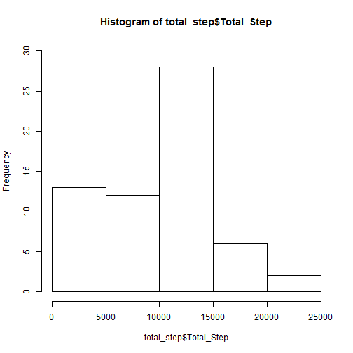
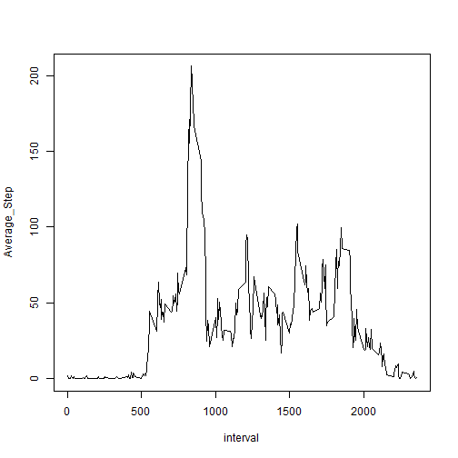
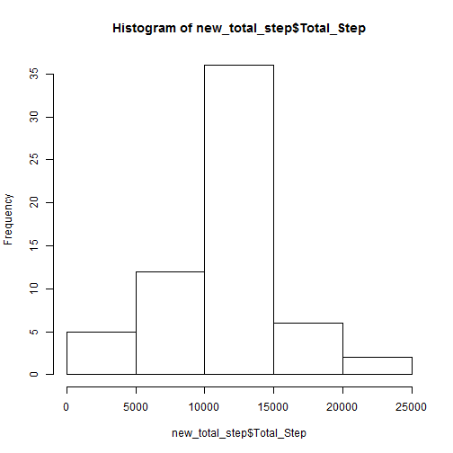
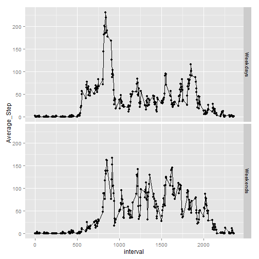

#Study on Personal Activity Using Monitoring Device

##Introduction
This project uses data collected from one idividual wearing monitoring devices suh as a Fitbit, Nicke Fuelband or Jawbone Up.
The data shows number of steps taken in 5 minute intervals each day during October & November 2012.

##Loading and preprocesing the data
1. Downloaded data from https://d396qusza40orc.cloudfront.net/repdata%2Fdata%2Factivity.zip
2. Save the data in working directory
3. Load the data to "R" studio


```r
Data <- read.csv("activity.csv")
Data$date <- as.Date(Data$date)
library(dplyr)
library(ggplot2)
library(scales)
```

##Q1: What is mean total number of steps taken per day (ignoring missing value)?

The following histogram is showing the total number of steps taken per day.

```r
total_step <- summarise(group_by(Data,date), Total_Step = sum(steps, na.rm=TRUE))
hist(total_step$Total_Step, ylim= c(0,30))
```

 


```r
Mean <- round(mean(total_step$Total_Step), 2)
Median <- median(total_step$Total_Step)
```

The mean value is 9354.23
The median value is 10395


##Q2: What is the average daily activity parttern?

The following graph shows that this individual averagely started taking steps after interval 500 and started slowing down after interval 2000.


```r
interval_step <- summarise(group_by(Data, interval), Average_Step = mean(steps, na.rm=TRUE))
plot(interval_step, type="l")
```

 

```r
MaxInt = interval_step$interval[which.max(interval_step$Average_Step)]
```
Interval 835 contains the maximum number of steps, on average across all days.

##Q3: Imputing missing values, how will missing values impact the calculations?

Considering missing values, first, we find the total number of missing value in the dataset

```r
Total_NA = sum(is.na(Data$steps))
Pct_NA = percent(Total_NA/nrow(Data))
```
Total missing value is 2304 which is 13.1% of the total dataset

One way to fill out missing value is by imputing the NA by using the average steps accros all days for that 5-minute interval.
The average steps per interval was created in questions 2 above

1. Merge the original Data and the Average steps per interval (from Q2)
2. Create the column Average steps per interval in the original data
3. Create another column, named "Filled Step"",  to take number of steps if the data is available, take the average step per interval if data is not available
4. Finally remove the original "step" column and "average steps per interval" column
5. Change the "Filled Step" name back to "steps"

```r
Filled_Data <- merge(Data,interval_step)
Filled_Data <- select(mutate(Filled_Data, Filled_Steps = ifelse(is.na(steps), Average_Step, steps)), interval, Filled_Steps, date)
Filled_Data <- rename(Filled_Data, steps = Filled_Steps)
```

The following is the revised histogram using the new dataset (without missing value)

```r
new_total_step <- summarise(group_by(Filled_Data,date), Total_Step = sum(steps))
hist(new_total_step$Total_Step)
```

 

The new mean value is :

```r
newMean = round(mean(new_total_step$Total_Step),2)
print(newMean)
```

```
## [1] 10766.19
```
The new mean median is :

```r
newMedian = round(median(new_total_step$Total_Step), 2)
print(newMedian)
```

```
## [1] 10766.19
```


```r
delta_mean = round(newMean - Mean, 2)
delta_median = round(newMedian - Median, 2)
```

By imputing the missing value, the new mean value is shifted by 1411.96 and the new median value is shifted by 371.19

Imputing the missing value into dataset shows significant difference.

##Q4: Are there differences in activity patterns between weekdays and weekends?
The following two graphs showing the difference between average steps taken on weekdays Vs weekends.


```r
newDF <- mutate(Filled_Data, wdays = ifelse(weekdays(date)=="Saturday"|weekdays(date)=="Sunday", "Weekends", "Weekdays"))
interval_step2 <- summarise(group_by(newDF, interval,wdays), Average_Step = mean(steps))

qplot(interval, Average_Step, data = interval_step2, facets = wdays~.) + geom_line()
```

 

The graphs shows that the maximum steps happened on weekdays between interval 800 - 1000.  However, on the weekend, it shows that between interval 800 - 2000 the individual had more uniform number of steps, averaging around 90 steps per interval


